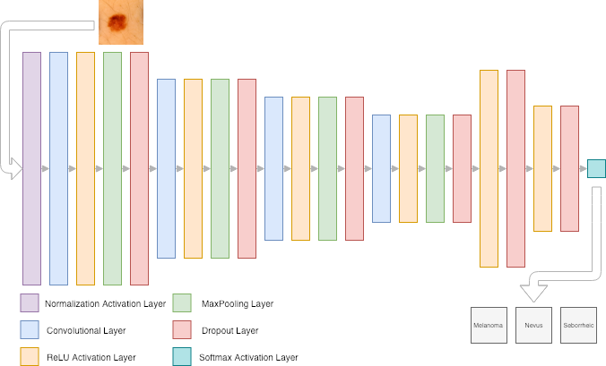

# Melanoma Skin Cancer Detection

Over the last few years, Deep Learning has been on the spotlight when it comes
to solving many complex problems, namely Convolutional Neural Networks (CNN) in
the field of image recognition.   

Since Neural Networks can sometimes achieve more than 50 layers deep,
Transfer Learning (TL) techniques are also getting popular to retrain some of the
layers of Neural Networks that learned from a generic dataset, putting it to use in another case.  

In this work, we attempted using CNNs and TL tecnhiques on pre-trained Neural Networks
to distinguish melanoma skin cancer from seborrheic keratosis and nevus benign tumors.

The dataset was originally available as a challenge at [ISIC 2017: Skin Lesion Analysis Towards Melanoma Detection](https://challenge.kitware.com/#challenge/n/ISIC_2017%3A_Skin_Lesion_Analysis_Towards_Melanoma_Detection).

# Architectures

The first solution consists of a DNN trained from scratch, namely a CNN, while the second 
uses TL techniques to apply ResNet and VGG19 pre-trained architectures in the resolution 
of this specific task. Both architectures were built and tested using the Keras framework.

Besides the different tecnhiques, two approaches for each one were taken. 
The first regards a multiclass classifier, in which the three classes (melanoma, 
seborrheic keratosis and nevus) were explicitly separated during the training process and, 
when applied to the test set, the last two classes were combined in a non-melanoma class. 
The second was merely a binary classifier, i.e., the dataset was already split in two classes, 
melanoma and non-melanoma, and the models learned to classify those two.

## CNN Architecture

## TL Architecture

Three main architectures were used - InceptionV3, ResNet50 and VGG19. The VGG19 network is 
19 layers deep, while the ResNet50 is 50 layers deep and InceptionV3 is 48 layers deep, 
and all can classify images into 1000 object categories, such as balls, cars and variety of animals. 

In order to perform melanoma detection, the hidden layers of the mentioned pre-trained 
architectures were frozen, so that their weights would not change during training. 
On the other hand, the output layer was changed to a densely-connected pooling layer 
with 3 or 2 units (regarding the different approaches), corresponding to the given context classes. 

After the three above mentioned architetures were retrained, various ensemble models were built
regarding these examples. This type of approach can produce better results by taking into account 
weaker models. The goal was achieved by creating combinations between them 
(InceptionV3+VGG19+ResNet, InceptionV3+VGG19, ...), and averaging the values of the respective output layers. 

# Results analysis

Although most of the current literature regarding DNN melanoma detection uses almost 
exclusively binary solutions, we initially opted for a different approach by trying 
to classify all the three different classes, melanoma, seborrheic keratosis e nevus. 
This work revelead itself to be a failure, thus the obvious next step was to follow the binary route.
Both the pure CNN and TL solutions performed relatively well, with an edge to the last one 
which was able to score a 0.90 F1Score on one of the tested models, mostly due to 
its more complex architecture.

All the results and further analysis can be consulted on the written paper at `skin-lesion-paper.pdf`.

Diogo Ferreira @UA  
Pedro Martins @UA
2018
